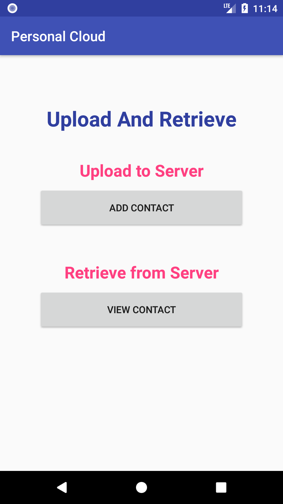
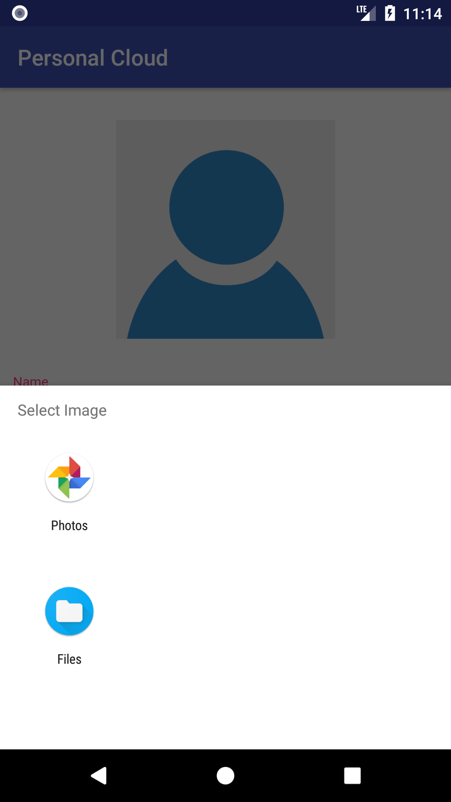
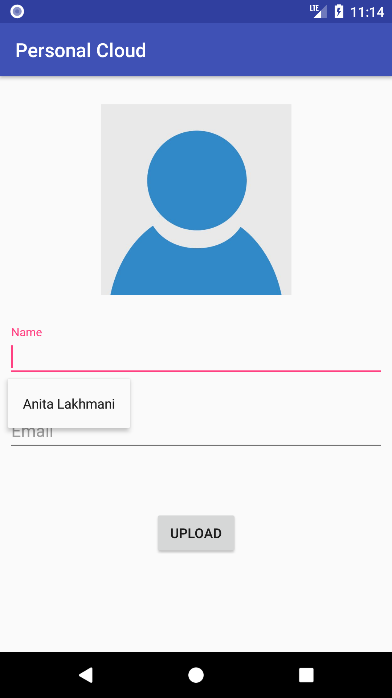

# Image Upload Retieve
<h1>About the App</h1>
<ul>
<li>This App is a basic Upload and Retrieve Module for any Binary Files(Image Here) on a Server.</li>
<li>The App uses a PHP Script in Backend for Uploading and Retrieval.</li>
<li>To Store the Images, they are First Encoded to String and then saved to Server.</li>
<li>Another way can be store in the form of a BLOB in MYSQL DB</li>
</ul>

<h1>Technologies Used</h1>
<ul>
<li>ANDROID Libraries</li>
<li>JAVA</li>
<li>PHP</li>
<li>MYSQL</li>
</ul>

<h1>Screenshots of the App</h1>
<table>
  <tr>
    <th>  </th>
    <th>  </th>
  </tr>
  <tr>
    <th>  </th>
    <th>  </th>
  </tr>
  </table>
  
<h1>Apk of Image Upload & Retrieve</h1>
<a href = "https://raw.githubusercontent.com/ashishlkhmn48/Image_Upload_Retieve/master/Android_Apps/ImageUploadRetieve/images/iu%26r.apk">Click to Download</a>

<h1>Backend Files of Image Upload & Retrieve for Reference</h1>
https://github.com/ashishlkhmn48/Image_Upload_and_Retrieve_Files

<h1>References</h1>
  <ul>
  <li>https://developer.android.com/reference/org/w3c/dom/Document.html</li>
  <li>https://www.w3schools.com</li>
  <li>https://stackoverflow.com</li>
</ul>
